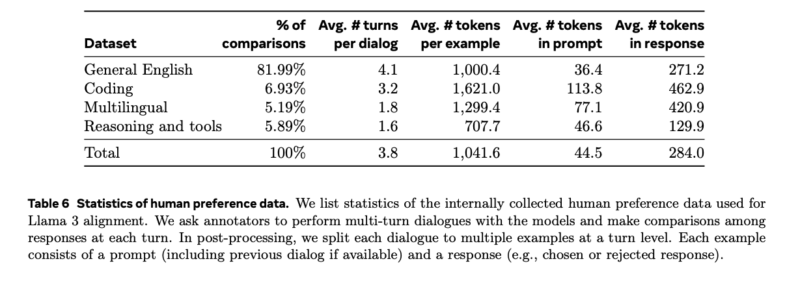
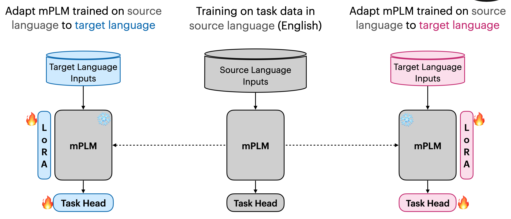
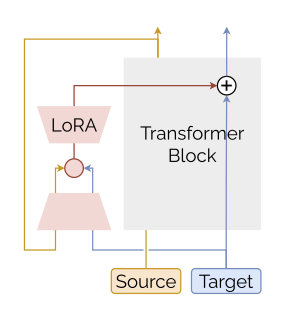
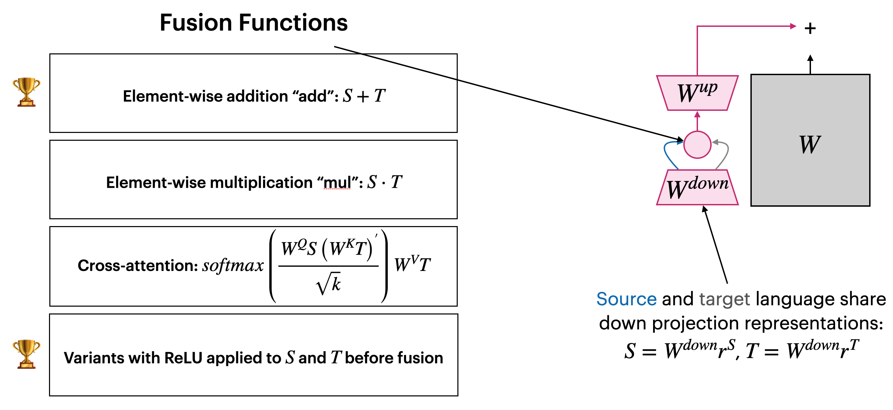
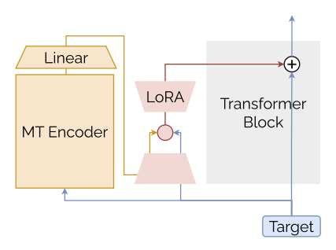
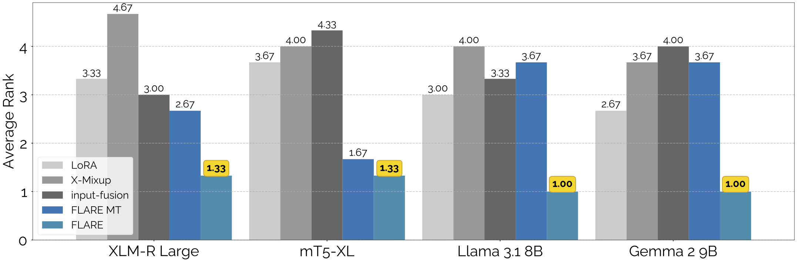
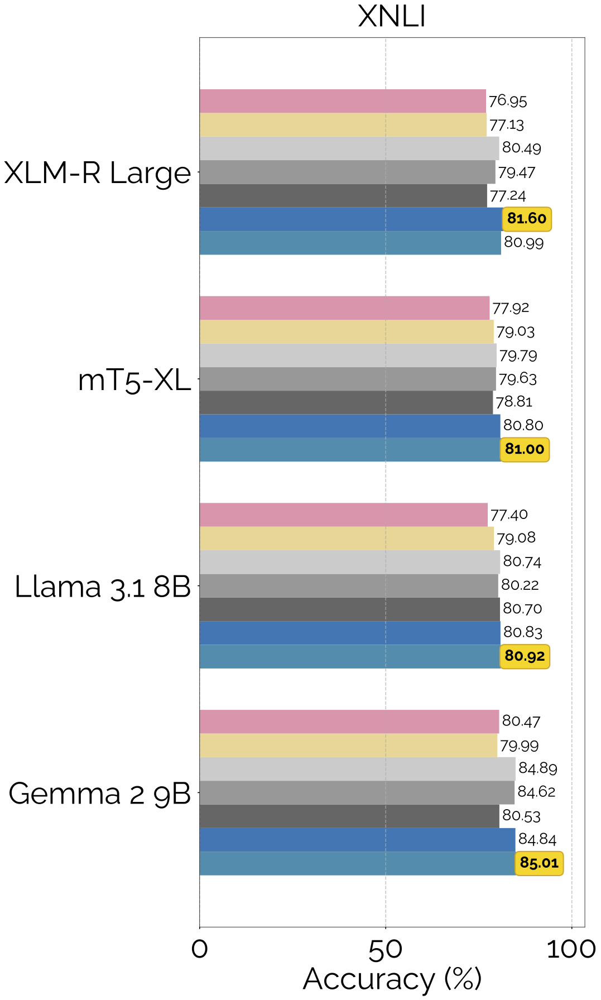
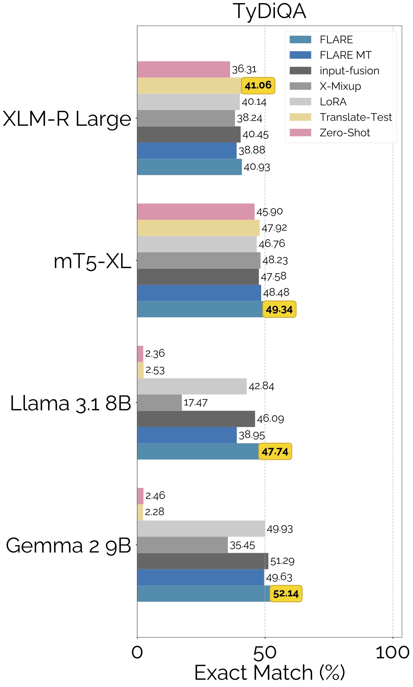
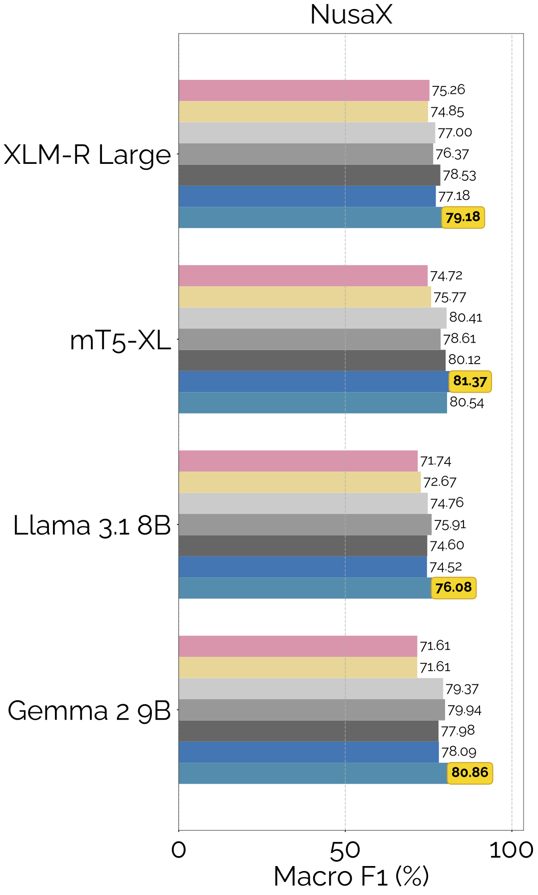

## Language Fusion for Parameter-Efficient Cross-lingual Transfer

  <a href="https://github.com/pnborchert/FLARE" target="_blank" style="display:flex;align-items:center;gap:0.5em;text-decoration:none;font-weight:500;"> GitHub</a>
  <a href="https://arxiv.org/abs/2501.06892" target="_blank" style="display:flex;align-items:center;gap:0.5em;text-decoration:none;font-weight:500;"> arXiv</a>

  
  
(Figure: Overview of FLARE)

  

    <h3 style="margin-top:0;">TL;DR:</h3>
    <ul style="margin-bottom:0;line-height:1.55;">
      <li><b>FLARE</b> fuses knowledge from both source language (English) and target language representations inside parameter-efficient adapters.</li>
      <li>Enables multilingual LLMs to perform better at natural language understanding (NLU) in low-resource languages, while remaining resource-efficient.</li>
      <li>No extra parameters or compute overhead, just clever adapter wiring and translation.</li>
    </ul>
  

---

### Motivation

Multilingual language models like Llama 3 and Gemma 2 are still trained almost entirely on English data, Llama 3's pretraining is only about <b>5% multilingual</b> 

  
  
(Llama 3 pretraining data ratio)

This imbalance results in a much stronger English representation space. Ideally, a cross-lingual transfer method can tap into these strong English representations when adapting to new (target) languages.

---

### Meet FLARE: Fusion for Language Representations!

FLARE an effective method that enables multilingual LLMs to use both source (e.g., English) and target language knowledge to improve NLU performance. 
It's also lightweight: FLARE doesn't add any additional parameters to the model.

---

### Cross-lingual Transfer: How it Works

We start with a multilingual LLM and assume we have labeled data in the source language (let's use English as our example). 
First, we fine-tune the model on English task data using supervised learning.

  
  
(Figure: Cross-lingual transfer setup)

---

### The FLARE Approach

To adapt to the target language, we use LoRA adapters inserted into the transformer's attention modules, leaving the original model weights frozen. 
Because labeled data in the target language is scarce, we machine-translate the English training set using NLLB 3.3B.

  
  
(Figure: Adapter and translation setup)

FLARE takes both the source and translated target text as input. For each forward pass, it does the following:

1. Runs a forward pass on the source language input to get strong English representations, which are fed into the LoRA adapter.
2. Processes the translated target language input in the regular forward pass, with target language representations also passed through the adapter.
3. <b>Within the adapter bottleneck, FLARE merges the source and target representations.</b> This fused representation continues up to the next transformer layer.
4. The process repeats for all layers.

  
  
(Figure: Fusion process in adapters)

---

### FLARE-MT: Making It Even More Efficient

The FLARE-MT variant skips the full forward pass on the source language input.  
Instead, it generates a <b>latent translation</b> using just the NLLB encoder and fuses this into every transformer layer in the main model.

  
  
(Figure: FLARE-MT variant, using latent translation)

---

### Results

FLARE is the <b>best performing translate-train method</b> in our experiments.

  
  
(Figure: Average rank for translate-train methods)

 
FLARE also outperforms other translate-test and zero-shot baselines:

  
  

    
    
(Cross-lingual transfer results XNLI)

  

  

    
    
(Cross-lingual transfer results TyDiQA)

  

  

    
    
(Cross-lingual transfer results NusaX)

  

<!-- 

  
  
(Table: Detailed results across languages/tasks)

 -->

For more details, ablation studies, and deeper analysis, check out the <a href="https://arxiv.org/abs/2501.06892" target="_blank">paper on arXiv</a>!

---